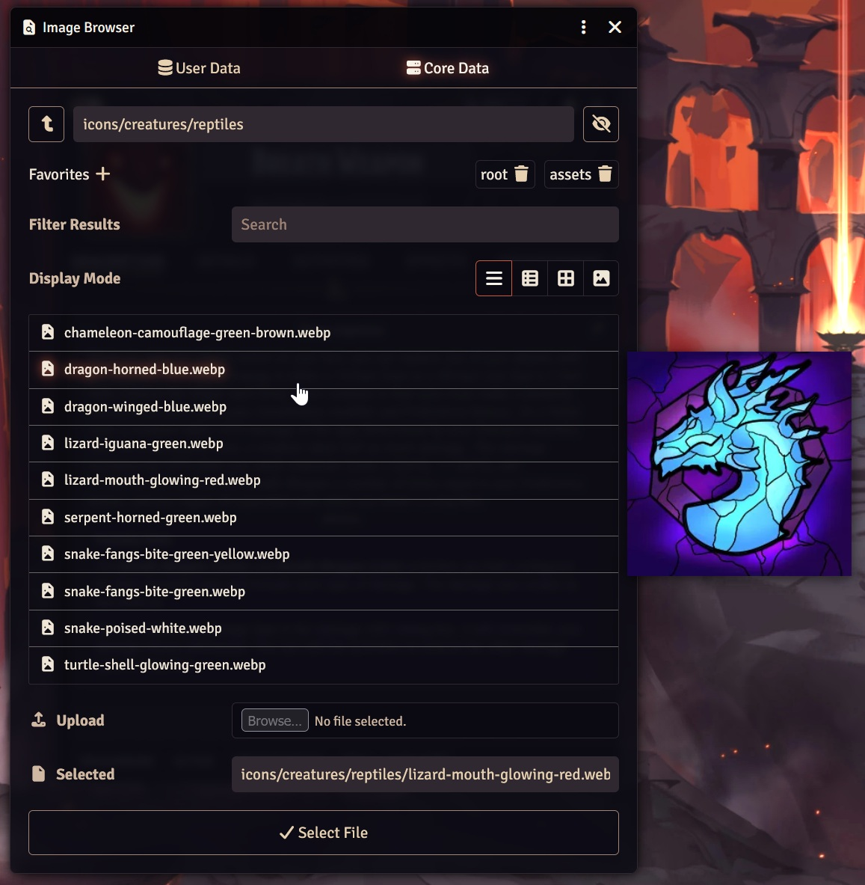

# Image Previewer Resurrected

FoundryVTT module to preview images on hover in the file picker menu.

Forked from syl3r86's original [image-previewer](https://github.com/syl3r86/image-previewer) module, which became unusable in v13. This is too useful to not have, so after experiencing yet another bout of suffering from its absence, I decided to rewrite it.

**Tested and works** on Foundry **v13 and v14**.

## Installation
1. Copy this link and use it in Foundry's Module Manager to install the module.

    > `https://github.com/LumosX/FVTT-image-previewer-resurrected/releases/latest/download/module.json`

2. Enable the module in your world's Module Management.

## Contribution
If you feel like supporting my work, keep an eye on the big things that are coming down the line.

You can support the original creator through his PayPal account: see the [README of the original repo](https://github.com/syl3r86/image-previewer#contribution).

## License
 
FVTT Image Previewer Resurrected by <a xmlns:cc="http://creativecommons.org/ns#" href="https://github.com/LumosX?tab=repositories" property="cc:attributionName" rel="cc:attributionURL">Lumos</a>, inspired by code created by <a xmlns:cc="http://creativecommons.org/ns#" href="https://github.com/LumosX?tab=repositories" property="cc:attributionName" rel="cc:attributionURL">Felix Müller</a>, is licensed under a <a rel="license" href="http://creativecommons.org/licenses/by/4.0/">Creative Commons Attribution 4.0 International License</a>.
